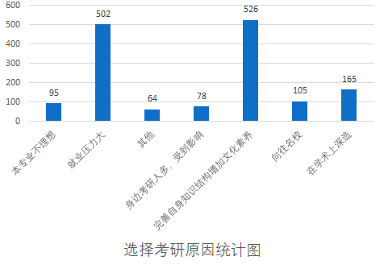
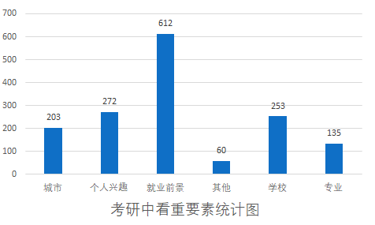

# 报考原因

> #### 大多数人为了提升自身素质
>
> - **完善自身知识结构增加文化素养：**526人选择这个选项，这显示了大多数学生考研是为了完善自我认知体系，认为考研可以改变自身，体现了我校学生整体是对知识和文化素养有较高追求的，学院在培养方案的调整中应适当对此情况进行参考。学术深造和向往名校也是主要因素。
>
> #### 学术深造和向往名校也是主要因素
>
> - **在学术上深造：** 165人选择这个选项，占总报考比例的11%，说明只有一部分同学考研是为了能进行学术深造，这个现象值得关注。
> - **向往名校：** 105 人选择这个选项，占总报考比例的11%，说明只有一部分同学考研是为了能进行学术深造，这个现象值得关注。
>
> #### 就业压力大是主要原因之一
>
> - **就业压力大：** 502人选择这个选项，这反映了很多学生考研的原因之一是为了缓解就业压力，所以学院在进行考研动员时，可以从就业这一学生最感兴趣的话题入手，提高学生的学习热情和积极性。

 

> #### 考研主要考虑因素：
>
> **学生最关注的因素是就业前景（40%），其次是个人兴趣（17.8%）和学校（16.7%）。**
>
> - **就业前景：** 610 人选择就业前景，这可能意味着学生普遍认为考研能够提升他们在职场上的竞争力，获得更好的就业机会。
> - **个人兴趣：** 272人选择个人兴趣，表明一部分学生在选择考研时更注重个人兴趣和爱好，而不仅仅是为了就业，后续学院可以在报考和补录环节，提供帮助和指导意见时，注意了解学生的个人兴趣爱好，以便于更好的进行指导和答疑工作。
>
> - **学校：** 在考研最看重的因素中，学校排名第三，说明学生对于报考院校有着一定的执着，在各学院进行报考指导时，需要对此原因加以谨慎斟酌。
>
> **城市、专业和其他因素相对较少被选择。**
>
> - **专业：** 135人选择专业，相对来说，专业并不是学生们考研报考时的主要考虑依据，有可能是因为对相关专业的了解不够深入，或者只根据录取人数的多少来进行报考选择，建议各学院在考研答疑时加大对相关专业的说明和分析。
>
> - **城市：** 203 人选择城市，这可能反映了一部分学生在选择考研时关注城市的发展前景或者生活质量。
