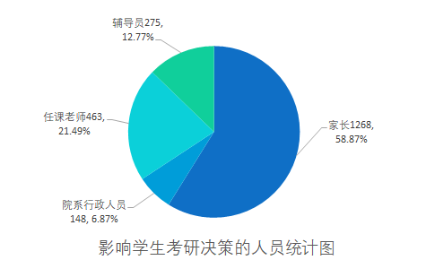

# 影响因素

> ####  任课老师和辅导员的影响较大
>
> - **任课老师：** 463人选择了任课老师，可能说明老师在学生的职业规划和考研动机中发挥了重要的指导和影响作用。建议老师在课堂上对于考研相关信息的传授和宣传要更加谨慎，因为大多数学生都会受到影响
> - **辅导员：** 276人选择了辅导员，同样表明辅导员在学生决定考研时也有一定的影响力。建议辅导员在日常工作中，多多关注和了解相关考研动态和信息，以便于给学生进行更深入的宣传和影响。
>
> ####  家长的影响较为显著
>
> - **家长：** 1268人选择了家长，这可能反映了在当今社会，家长在子女教育和职业规划中的决策权较大。建议学校和家长之间有更加积极和顺畅的沟通渠道，家校社共同发力，为学生的考研决策提供更加积极和高效的影响。