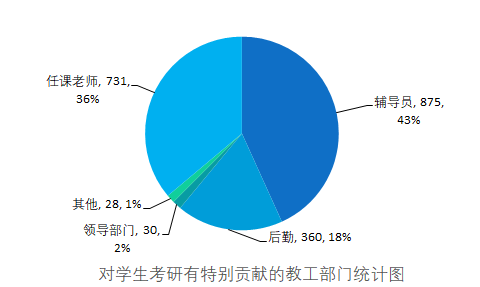

## 整体情况

> - 辅导员的影响:选择辅导员的人数达到875人，占43%。这可能意味着辅导员在考研过程中扮演了重要的角色，提供了有力的支持和指导。
> - 任课老师的影响:选择任课老师的人数为731人，占36%。这表明在学科专业知识的学习过程中，学生对任课老师的贡献也十分认可。
> - 后勤服务的影响:选择后勤服务的人数为360人，虽然相对较少，但仍然是一个不可忽视的群体。这可能表示后勤服务在提供学习和生活方面的支持上发挥了一定的作用。
> - 领导部门的影响:选择领导部门的人数相对较少，只有30人。这可能表明在整个考研过程中，学生对领导部门的直接影响相对较小
> - 其他选择的影响:选择其他的人数为28人，这包括了一些非常规的支持来源。

## 传播学院

## 经济学院

## 人文学院

## 融媒学院

## 商学院

## 外语学院

## 信息工程学院

## 艺术（设计）学院

## 医学院

